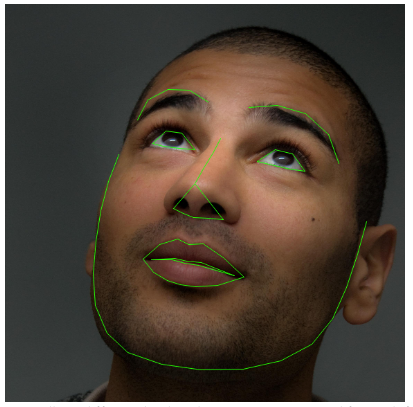
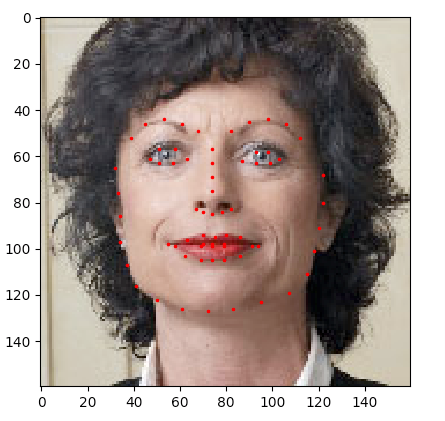

# 数据导入与处理

来自[这里](https://pytorch.org/tutorials/beginner/data_loading_tutorial.html)。  

在解决任何机器学习问题时，都需要在处理数据上花费大量的努力。PyTorch提供了很多工具来简化数据加载，希望使代码更具可读性。在本教程中，我们将学习如何从繁琐的数据中加载、预处理数据或增强数据。  

开始本教程之前，请确认你已安装如下Python包：  

* scikit-image：图像IO操作和格式转换
* pandas：更方便解析CSV  

我们接下来要处理的数据集是人脸姿态。这意味着人脸的注释如下：



总之，每个面部都有68个不同标记点。  

> 可以从[这里](https://download.pytorch.org/tutorial/faces.zip)下载数据集，并将其解压后存放到目录‘data/faces/’。

数据集来自带有面部注释的CSV文件，文件内容类似以下格式：  

```text
image_name,part_0_x,part_0_y,part_1_x,part_1_y,part_2_x, ... ,part_67_x,part_67_y
0805personali01.jpg,27,83,27,98, ... 84,134
1084239450_e76e00b7e7.jpg,70,236,71,257, ... ,128,312
```

接下来我们快速读取CSV文件，并从(N,2)数组中获取注释，N表示标记数量。  

```python
landmarks_frame = pd.read_csv('data/faces/face_landmarks.csv')

n = 65
img_name = landmarks_frame.iloc[n, 0]
landmarks = landmarks_frame.iloc[n, 1:].as_matrix()
landmarks = landmarks.astype('float').reshape(-1, 2)

print('Image name: {}'.format(img_name))
print('Landmarks shape: {}'.format(landmarks.shape))
print('First 4 Landmarks: {}'.format(landmarks[:4]))
``` 

输出：  

```python
Image name: person-7.jpg
Landmarks shape: (68, 2)
First 4 Landmarks: [[32. 65.]
 [33. 76.]
 [34. 86.]
 [34. 97.]]
```

现在我们写一个简单的帮助函数：展示图片和它的标记，用它来展示样本。  

```python
def show_landmarks(image,landmarks):
    '''
    展示带标记点的图像
    '''
    plt.imshow(image)
    plt.scatter(landmarks[:,0],landmarks[:,1],s=10,marker='.',c='r')
    plt.pause(10)

plt.figure()
show_landmarks(io.imread(os.path.join('data/faces',img_name)),landmarks)
plt.show()
```

  

## 数据集类（Dataset class）

`torch.utils.data.Dataset`是一个表示数据集的抽象类。你自定义的数据集应该继承`Dataset`并重写以下方法：  

* __len__ 这样`len(dataset)`是可以返回数据集的大小
* __getitem__ 支持索引操作，比如`dataset[i]`来获取第i个样本。  

现在我们来实现我们的面部标记数据集类。