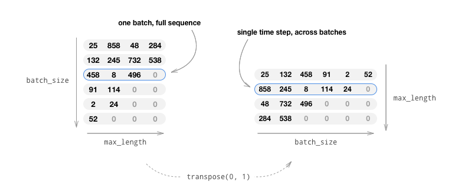
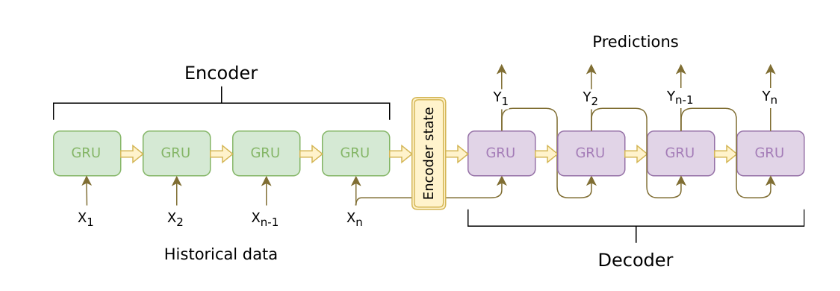
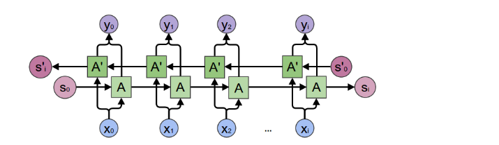
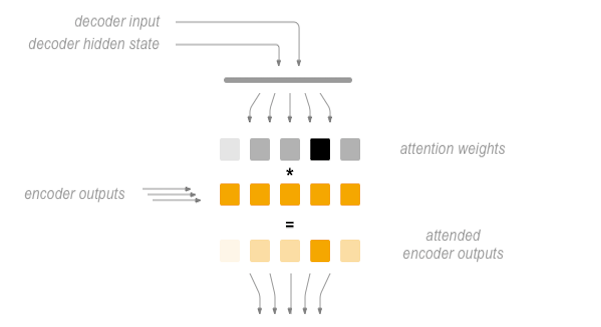
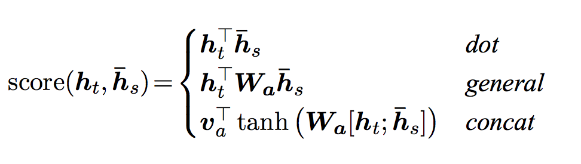
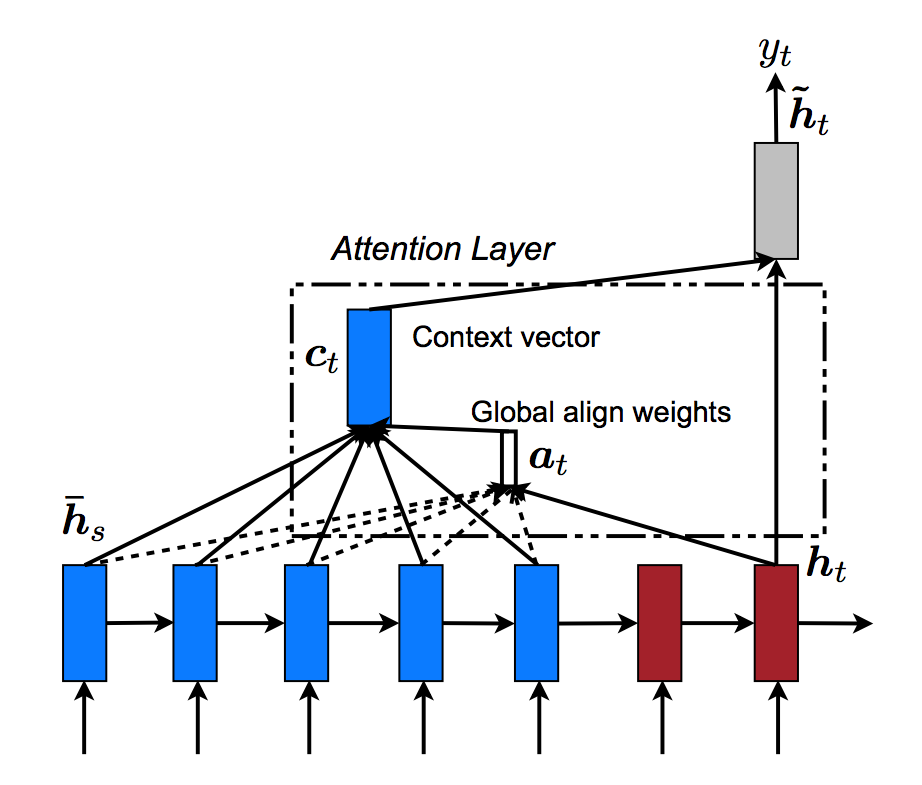
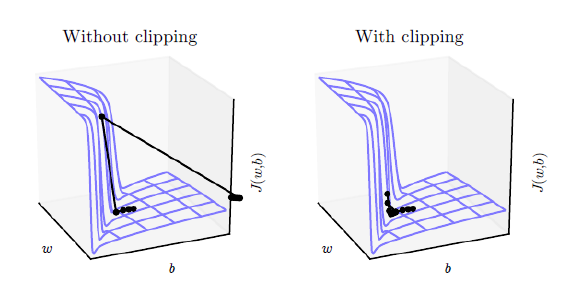

# 聊天机器人

来自[这里](https://pytorch.org/tutorials/beginner/chatbot_tutorial.html)。  

在本教程中，我们将探索一个有趣的用例，即循环序列到序列模型。我们将使用[Cornell Movie-Dialogs Corpus](https://www.cs.cornell.edu/~cristian/Cornell_Movie-Dialogs_Corpus.html)中的电影脚本来训练一个简单的聊天机器人。  

会话模型是人工智能研究的一个热门话题。聊天机器人可以在各种环境中找到，包括客户服务程序和在线帮助。这些机器人通常由基于检索的模型提供支持，这些模型输出对特定形式问题的预定义响应。在像公司的IT服务台这样高度受限的领域，这些模型可能够用了，但对于更一般的使用场景，它们还不够健壮。教会机器在多个领域与人进行有意义的对话是一个远未解决的问题。最近，深度学习热潮使得强大的生成模型成为可能，比如Google的神经会话模型，这标志着向多领域生成会话模型迈进了一大步。在本教程中，我们将使用PyTorch来实现这一模型。  

  

```text
> hello?
Bot: hello .
> where am I?
Bot: you re in a hospital .
> who are you?
Bot: i m a lawyer .
> how are you doing?
Bot: i m fine .
> are you my friend?
Bot: no .
> you're under arrest
Bot: i m trying to help you !
> i'm just kidding
Bot: i m sorry .
> where are you from?
Bot: san francisco .
> it's time for me to leave
Bot: i know .
> goodbye
Bot: goodbye .
```
## 教程要点  

* 导入和处理[<font color=red>Cornell Movie-Dialogs Corpus</font>](https://www.cs.cornell.edu/~cristian/Cornell_Movie-Dialogs_Corpus.html)数据集
* 使用[<font color=red>Luong attention mechanism(s)</font>](https://arxiv.org/abs/1508.04025)实现*序列到序列*模型
* 使用最小批量联合训练编码器和解码器
* 实现greedy-search解码模型
* 与训练有素的机器人互动  

## 准备工作

开始之前，需要先从[这里](https://www.cs.cornell.edu/~cristian/Cornell_Movie-Dialogs_Corpus.html)下载数据包并解压到当前目录下的`data/`目录下。然后我们导入一些必要的包：  

```python
from __future__ import absolute_import
from __future__ import division
from __future__ import print_function
from __future__ import unicode_literals

import torch
from torch.jit import script, trace
import torch.nn as nn
from torch import optim
import torch.nn.functional as F
import csv
import random
import re
import os
import unicodedata
import codecs
from io import open
import itertools
import math

device = torch.device('cuda:0' if torch.cuda.is_available() else 'cpu')
``` 

## 导入和处理数据  

接下来要做的是重新格式化我们的数据并导入到我们要使用的结构中。  

[<font color=red>Cornell Movie-Dialogs Corpus</font>](https://www.cs.cornell.edu/~cristian/Cornell_Movie-Dialogs_Corpus.html)是一个丰富的电影任务对话数据集：  

* 10,292对电影人物间的220,579次对话交流
* 来自617部电影的9035位电影人物
* 总计304,713次对话

该数据集庞大多样，语言形式、时间、情感等方面存在较大差异。我们希望这种多样性使我们的模型对许多形式的输入和查询都具有健壮性。

首先，我们查看下数据文件中一些行，来了解下原始格式：  

```python
corpus_name = 'cornell movie-dialogs corpus'
corpus = os.path.join('data', corpus_name)


def printLines(file, n=10):
    with open(file, 'rb') as datafile:
        lines = datafile.readlines()

    for line in lines[:n]:
        print(line)


printLines(os.path.join(corpus, 'movie_lines.txt'))
```  

输出：  

```text
b'L1045 +++$+++ u0 +++$+++ m0 +++$+++ BIANCA +++$+++ They do not!\n'
b'L1044 +++$+++ u2 +++$+++ m0 +++$+++ CAMERON +++$+++ They do to!\n'
b'L985 +++$+++ u0 +++$+++ m0 +++$+++ BIANCA +++$+++ I hope so.\n'
b'L984 +++$+++ u2 +++$+++ m0 +++$+++ CAMERON +++$+++ She okay?\n'
b"L925 +++$+++ u0 +++$+++ m0 +++$+++ BIANCA +++$+++ Let's go.\n"
b'L924 +++$+++ u2 +++$+++ m0 +++$+++ CAMERON +++$+++ Wow\n'
b"L872 +++$+++ u0 +++$+++ m0 +++$+++ BIANCA +++$+++ Okay -- you're gonna need to learn how to lie.\n"
b'L871 +++$+++ u2 +++$+++ m0 +++$+++ CAMERON +++$+++ No\n'
b'L870 +++$+++ u0 +++$+++ m0 +++$+++ BIANCA +++$+++ I\'m kidding.  You know how sometimes you just become this "persona"?  And you don\'t know how to quit?\n'
b'L869 +++$+++ u0 +++$+++ m0 +++$+++ BIANCA +++$+++ Like my fear of wearing pastels?\n'
```  

### 创建格式化的数据文件  

为了方便起见，我们将创建一个格式友好的数据文件，其中每一行都包含一个查询语句和响应语句对。  

下面的函数有助于解析原始的*movie_lines.txt*数据文件。  

* `loadLines`把文件中的每一行分隔成字典字段（行号、角色序号、电影序号、演员、文本等）
* `loadCinversations` 基于*movie_conversations.txt*将`loadLines`得到行字段分组到对话中
* `extractSentencePairs` 从对话中提取句子  

```python
# 把文件中的每一行分隔成字典字段
def loadLines(filename, fields):
    lines = {}
    with open(filename, 'r', encoding='iso-8859-1') as f:
        for line in f:
            values = line.split(' +++$+++ ')
            # 提取字段
            lineobj = {}
            for i, field in enumerate(fields):
                lineobj[field] = values[i]
            lines[lineobj['lineID']] = lineobj
    return lines


# 基于*movie_conversations.txt*将`loadLines`得到行字段分组到对话中
def loadConversations(filename, lines, fields):
    conversations = []
    with open(filename, 'r') as f:
        for line in f:
            values = line.split(' +++$+++ ')
            convobj = {}
            for i, field in enumerate(fields):
                convobj[field] = values[i]
            lineIds = eval(convobj['utteranceIDs'])
            convobj['lines'] = []
            for lineId in lineIds:
                convobj['lines'].append(lines[lineId])
            conversations.append(convobj)

    return conversations


# 从对话中提取句子
def extractSentencePairs(conversations):
    qa_pairs = []
    for conversation in conversations:
        for i in range(len(conversation['lines']) - 1):
            inputline = conversation['lines'][i]['text'].strip()
            targetline = conversation['lines'][i+1]['text'].strip()

            if inputline and targetline:
                qa_pairs.append([inputline, targetline])
    return qa_pairs
```  

接下来我们调用这些函数来生成文件，命名为`formatted_movie_lines.txt`。  

```python
# 定义新生成文件的路径
datafile = os.path.join(corpus, 'formatted_movie_lines.txt')

delimiter = '\t'
delimiter = str(codecs.decode(delimiter, 'unicode_escape'))

# 初始化行字典、对话列表和字段id
lines = {}
conversations = []
MOVIE_LINES_FIELDS = ['lineID', 'characterID', 'movieID', 'character', 'text']
MOVIE_CONVERSATIONS_FIELDS = ['character1ID',
                              'character2ID', 'movieID', 'utteranceIDs']

print('\nProcessing corpus...')
lines = loadLines(os.path.join(corpus, 'movie_lines.txt'), MOVIE_LINES_FIELDS)
print('\nLoading conversations...')
conversations = loadConversations(os.path.join(
    corpus, 'movie_conversations.txt'), lines, MOVIE_CONVERSATIONS_FIELDS)

# 写入新文件
print('\nWriting newly formatted file...')
with open(datafile, 'w', encoding='utf-8') as outfile:
    writer = csv.writer(outfile, delimiter=delimiter, lineterminator='\n')
    for pair in extractSentencePairs(conversations):
        writer.writerow(pair)

# 输出部分样本
print('\nSample lines from file:')
printLines(datafile)
```  

输出：  

```text
Processing corpus...

Loading conversations...

Writing newly formatted file...

Sample lines from file:
b"Can we make this quick?  Roxanne Korrine and Andrew Barrett are having an incredibly horrendous public break- up on the quad.  Again.\tWell, I thought we'd start with pronunciation, if that's okay with you.\n"
b"Well, I thought we'd start with pronunciation, if that's okay with you.\tNot the hacking and gagging and spitting part.  Please.\n"
b"Not the hacking and gagging and spitting part.  Please.\tOkay... then how 'bout we try out some French cuisine.  Saturday?  Night?\n"
b"You're asking me out.  That's so cute. What's your name again?\tForget it.\n"
b"No, no, it's my fault -- we didn't have a proper introduction ---\tCameron.\n"
b"Cameron.\tThe thing is, Cameron -- I'm at the mercy of a particularly hideous breed of loser.  My sister.  I can't date until she does.\n"
b"The thing is, Cameron -- I'm at the mercy of a particularly hideous breed of loser.  My sister.  I can't date until she does.\tSeems like she could get a date easy enough...\n"
b'Why?\tUnsolved mystery.  She used to be really popular when she started high school, then it was just like she got sick of it or something.\n'
b"Unsolved mystery.  She used to be really popular when she started high school, then it was just like she got sick of it or something.\tThat's a shame.\n"
b'Gosh, if only we could find Kat a boyfriend...\tLet me see what I can do.\n'
```  

### 导入和整理数据  

我们接下来要做的是创建一个词汇表并将问/答语句对导入到内存中。  

注意，我们处理的是单词序列，它没有到离散数字空间的隐式映射。因此我们必须通过映射我们在数据集中遇到的每一个唯一的词到一个索引值的方法创建一个。  

所以我们定义一个`Voc`类，它保存词到索引的映射、索引到词的反映射、每个单词的计数和总词数。类中提供了向词汇表中添加单词(`addWord`)、添加一个句子中所有的词(`addSentence`)和修建不常见的词(`trim`)。更多关于`trimming`稍后介绍。  

```python
# 默认文字标记
PAD_token = 0   # 用来追加段句子
SOS_token = 0   # 句首标记
EOS_token = 0   # 句尾标记


class Voc:
    def __init__(self, name):
        self.name = name
        self.trimmed = False
        self.word2index = {}
        self.word2count = {}
        self.index2word = {PAD_token: 'PAD',
                           SOS_token: 'SOS', EOS_token: 'EOS'}
        self.num_words = 3
    
    def addSentence(self,sentence):
        for word in sentence.split(' '):
            self.addWord(word)

    def addWord(self,word):
        if word not in self.word2index:
            self.word2index[word] = self.num_words
            self.word2count[word] = 1
            self.index2word[self.num_words] = word
            self.num_words += 1
        else:
            self.word2count[word] += 1

    def trim(self,min_count):
        if self.trimmed:
            return
        self.trimmed = True

        keep_words = []

        for k,v in self.word2count.items():
            if v >= min_count:
                keep_words.append(k)

        print('keep_words {} / {} = {:.4f}'.format(
            len(keep_words),len(self.word2index),len(keep_words)/len(self.word2index)
        ))

        self.word2index = {}
        self.word2count = {}
        self.index2word = {PAD_token: 'PAD',
                           SOS_token: 'SOS', EOS_token: 'EOS'}
        self.num_words = 3

        for word in keep_words:
            self.addWord(word)
```

现在我们可以收集我们的词汇表和问/答语句对。在我们准备使用这些数据前，我们还必须做些处理。  

首先，我们需要使用`unicodeToAscii`将Unicode字符串转成ASCII。接着，我们需要使用`normalizeString`将所有的字母转为小写字母并裁减掉除基本标点符号外的所有非字母字符。最后，为了帮助训练收敛性，我们将使用`filterPairs`过滤长度大于MAX_LENGTH阈值的句子。  

```python
MAX_LENGTH = 10

# Unicode字符串转ASCII
def unicodeToAscii(s):
    return ''.join(
        c for c in unicodedata.normalize('NFD', s)
        if unicodedata.category(c) != 'Mn'
    )

# 小写化，裁剪、移除非字母字符
def normalizeString(s):
    s = unicodeToAscii(s.lower().strip())
    s = re.sub(r"([.!?])", r" \1", s)
    s = re.sub(r"[^a-zA-Z.!?]+", r" ", s)
    s = re.sub(r"\s+", r" ", s).strip()
    return s

# 读取问/大对并返回词汇表对象
def readVoc(datafile, corpus_name):
    print('Reading lines...')
    # 读取文件并切割成行
    lines = open(datafile, encoding='utf-8').read().strip().split('\n')

    # 分割行成对并标准化
    pairs = [[normalizeString(s) for s in l.split('\t')] for l in lines]
    voc = Voc(corpus_name)
    return voc, pairs


# 如果问/答对p中的语句都在MAX_LENGTH阈值之下，返回True
def filterPair(p):
    return len(p[0].split(' ')) < MAX_LENGTH and len(p[1].split(' ')) < MAX_LENGTH

# 过滤
def filterPairs(pairs):
    return [pair for pair in pairs if filterPair(pair)]

# 使用上面定义的函数，返回填充过的词汇表和问答对列表
def loadPrepareDate(corpus,corpus_name,datafile,save_dir):
    print('Start preparing training data ...')
    voc,pairs = readVoc(datafile,corpus_name)
    print('Read {!s} sentence pairs'.format(len(pairs)))
    pairs = filterPairs(pairs)
    print('Trimmed to {!s} sentence pairs'.format(len(pairs)))
    print('Counting words...')
    for pair in pairs:
        voc.addSentence(pair[0])
        voc.addSentence(pair[1])
    print('Counted words: ',voc.num_words)
    return voc,pairs

# 调用
save_dir = os.path.join('data','save')
voc,pairs = loadPrepareDate(corpus,corpus_name,datafile,save_dir)
print('\npairs:')
for pair in pairs[:10]:
    print(pair)
```

输出：  

```text
Start preparing training data ...
Reading lines...
Read 221282 sentence pairs
Trimmed to 64271 sentence pairs
Counting words...
Counted words:  18008

pairs:
['there .', 'where ?']
['you have my word . as a gentleman', 'you re sweet .']
['hi .', 'looks like things worked out tonight huh ?']
['you know chastity ?', 'i believe we share an art instructor']
['have fun tonight ?', 'tons']
['well no . . .', 'then that s all you had to say .']
['then that s all you had to say .', 'but']
['but', 'you always been this selfish ?']
['do you listen to this crap ?', 'what crap ?']
['what good stuff ?', 'the real you .']
```

另一个有利于在训练期间实现更快速收敛的策略是修剪我们词汇表中很少使用的词。减少特征空间的维度可以弱化模型必须学习的逼近函数的难度。我们将分两步来处理：  

1. 使用`voc.trim`函数裁剪使用低于`MIN_COUNT`阈值的词
2. 使用裁剪的词过滤语句对  

```python
MIN_COUNT = 3  

def trimRareWords(voc,pairs,MIN_COUNT):
    # 裁剪词汇表中使用次数在MIN_COUNT阈值之下的词
    voc.trim(MIN_COUNT)
    # 使用裁剪的词过滤语句对
    keep_pairs = []
    for pair in pairs:
        input_sentence = pair[0]
        output_sentence = pair[1]
        keep_input = True
        keep_output = True

        # 检查输入语句
        for word in input_sentence.split(' '):
            if word not in voc.word2index:
                keep_input = False
                break
        # 检查输出语句
        for word in output_sentence.split(' '):
            if word not in voc.word2index:
                keep_output = False
                break
        
        if keep_input and keep_output:
            keep_pairs.append(pair)

    print('Trimmed from {} pairs to {}, {:.4f} of total'.format(len(pairs),len(keep_pairs),len(keep_pairs)/len(pairs)))
    return keep_pairs

pairs =trimRareWords(voc,pairs,MIN_COUNT)
```  

输出：  

```text
keep_words 7823 / 18005 = 0.4345
Trimmed from 64271 pairs to 53165, 0.8272 of total
```  

## 为模型处理数据  

尽管我们已经花费了大量的努力来处理和粉饰词汇表和语句对列表中的数据，但是最终我们模型期望数值型torch张量作为输入。在<font color="red">seq2seq转换教程</font>中可以找到一种为模型准备处理后数据的方法。在那个教程中，我们使用的批大小是1，意味着我们所要做的就是将我们语句对中词转换成词汇表中恰当的索引值并输入给模型。  

然而，如果你对加速训练或者想利用GPU并行化处理，那么你需要小批量进行训练。  

使用小批量也意味着我们需要记住我们所有批次中句子长度的差异。为了在同一批处理中容纳不同大小的句子，我们将使批处理后的输入张量的shape为(max_length,batch_size)，其中小于max_length的句子在EOS_token之后用0填充。  

如果我们通过将单词转换成索引(`indexesFromSentence`)和零值填充的方式简单地将语句转换成张量，我们的张量将有shape(batch_size,max_length)，索引第一个维度将在所有时间步长返回一个完整的序列。然而，我们需要在一段时间内索引我们的批次，并且包括批次中的所有序列。因此，我们将我们输出批次的shape转为(*max_kength*,*batch_size*)，这样索引第一个维度返回批处理中所有句子的时间步长。我们在`zeroPadding`函数中隐式处理这个转换。  

  

`inputVar`函数处理将语句转换成张量的过程，最终创建一个形状正确的零填充张量。同时它也返回一个`lengths`张量，用于批次中的每个序列，稍后将传递给我们的编码器。  

`outputVar`函数功能与`inputVar`相似，但是不返回`lengths`张量，而是返回一个二进制掩码张量和最大目标语句的长度。二进制掩码张量有着与输出目标张量相同的邢专，但*PAD_token*元素为0，其它为1。  

`batch2TrainData`简单地输入一系列语句对转化，通过上述函数处理返回输入和目标张量。  

```python
def indexesFromSentence(voc, sentence):
    return [voc.word2index[word] for word in sentence.split(' ')] + [EOS_token]


def zeroPadding(l, fillvalue=PAD_token):
    return list(itertools.zip_longest(*l, fillvalue=fillvalue))


def binaryMatrix(l, value=PAD_token):
    m = []
    for i, seq in enumerate(l):
        m.append([])
        for token in seq:
            if token == PAD_token:
                m[i].append(0)
            else:
                m[i].append(1)
    return m


def inputVar(l, voc):
    indexes_batch = [indexesFromSentence(voc, sentence) for sentence in l]
    lengths = torch.tensor([len(indexes) for indexes in indexes_batch])
    padList = zeroPadding(indexes_batch)
    padVar = torch.LongTensor(padList)
    return padVar, lengths


def outputVar(l, voc):
    indexes_batch = [indexesFromSentence(voc, sentence) for sentence in l]
    max_target_len = max([len(indexes) for indexes in indexes_batch])
    padList = zeroPadding(indexes_batch)
    mask = binaryMatrix(padList)
    mask = torch.ByteTensor(mask)
    padVar = torch.LongTensor(padList)
    return padVar, mask, max_target_len


def batch2TrainData(voc, pair_batch):
    pair_batch.sort(key=lambda x: len(x[0].split(' ')), reverse=True)
    input_batch, output_batch = [], []
    for pair in pair_batch:
        input_batch.append(pair[0])
        output_batch.append(pair[1])
    inp, lengths = inputVar(input_batch, voc)
    output, mask, max_target_len = outputVar(output_batch, voc)
    return inp, lengths, output, mask, max_target_len


# 验证
small_batch_size = 5
batches = batch2TrainData(voc, [random.choice(pairs)
                                for _ in range(small_batch_size)])
input_variable, lengths, target_variable, mask, max_target_len = batches

print('input variable:', input_variable)
print('lengths:', lengths)
print('target variable:', target_variable)
print('mask:', mask)
print('max_target_len:', max_target_len)
```

输出：  

```python
input variable: tensor([[   7,  112,   36,    7,  348],
        [  18,  785,   37,   89,   64],
        [ 709, 2100, 4428,  527,    4],
        [4932,    7,   12,   45,    0],
        [ 313,  236, 3736, 1947,    0],
        [ 329,    4,   56,    4,    0],
        [ 791,    4,  283,    0,    0],
        [1127,    4,    4,    0,    0],
        [   6,    0,    0,    0,    0],
        [   0,    0,    0,    0,    0]])
lengths: tensor([10,  9,  9,  7,  4])
target variable: tensor([[ 304,  236,   33,   61,    8],
        [1985,   50,    6,  250,  371],
        [   4,    6,    0, 2235,   96],
        [   0,    0,    0,  174,   81],
        [   0,    0,    0,   12,    6],
        [   0,    0,    0,  477,    0],
        [   0,    0,    0,    4,    0],
        [   0,    0,    0,    0,    0]])
mask: tensor([[1, 1, 1, 1, 1],
        [1, 1, 1, 1, 1],
        [1, 1, 0, 1, 1],
        [0, 0, 0, 1, 1],
        [0, 0, 0, 1, 1],
        [0, 0, 0, 1, 0],
        [0, 0, 0, 1, 0],
        [0, 0, 0, 0, 0]], dtype=torch.uint8)
max_target_len: 8
```  

## 定义模型  

### Seq2Seq 模型  

我们的聊天机器人的核心是序列到序列（seq2seq）模型。seq2seq模型的目标是将可变长度的序列作为输入，通过固定大小模型返回一个可变长度的序列作为输出。  

[<font color="red">Sutskever et al.</font>](https://arxiv.org/abs/1409.3215)发现通过两个独立的递归神经网络，我们可以完成这项任务。其中一个RNN充当编码器，它将可变长度的输入序列编码为固定长度的上下文向量。理论上，这个上下文向量(RNN的最后一个隐藏层)将包含关于输入到机器人的查询语句的语义信息。第二个RNN是一个解码器，它接受一个输入单词和上下文向量，并返回序列中下一个单词的猜测和一个隐藏状态，以便在下一次迭代中使用。  

  

图像来源：[https://jeddy92.github.io/JEddy92.github.io/ts_seq2seq_intro/](https://jeddy92.github.io/JEddy92.github.io/ts_seq2seq_intro/)  

### 编码器  

编码器RNN遍历输入语句，每次一个token(例如 word)，每一步输出一个输出向量和一个隐藏状态向量。然后隐藏状态向量被传入下一步，同时记录输出向量。编码器将序列中每个点的上下文转换为高维空间中的一组点，解码器将使用这些点为给定的任务生成有意义的输出。  

我们的编码器的核心是一个多层门控循环单元，由[<font color="red">Cho et al</font>](https://arxiv.org/pdf/1406.1078v3.pdf)。在2014年。我们将使用GRU的双向变体，这意味着本质上有两个独立的RNNs:一个按正常顺序输入序列，另一个按相反顺序输入序列。每个网络的输出在每个时间步长上求和。使用双向GRU将为我们提供编码过去和未来上下文的优势。  

双向RNN：  



图片来源：[https://colah.github.io/posts/2015-09-NN-Types-FP/](https://colah.github.io/posts/2015-09-NN-Types-FP/)  

注意，嵌入层用于在任意大小的特征空间中编码单词索引。对于我们的模型，这个层将把每个单词映射到一个大小为hidden_size的特征空间。当经过训练时，这些值应该编码相似语义单词之间的语义相似性。  

最后，如果填充序列传入给RNN模型，那么我们必须分别使用`nn.utils.rnn.pack_padded_sequence`和`nn.utils.rnn.pad_packed_sequence`来打包和解包RNN输入中的填充。  

**计算图**：  

1. 将单词索引转换成嵌入
2. 为RNN模型打包填充批次序列
3. 正向通过GRU
4. 解包填充
5. 求和双向GRU输出
6. 返回输出和最终隐藏状态  

**输入**：  

* `input_seq`：输入序列的批次，shape=(*max_length*,*batch_size*)
* `input_lengths`：对应批次中每个序列长度的列表，shape=(*batch_size*)
* `hidden`：隐藏状态，shape=(*n_layers x num_directions*,*batch_size*,*hidden_size*)  

**输出**：  

* `outputs`：GRU最后一个隐藏层的输出特征（求和双向输出）,shape=(*max_length*,*batch_size*,*hidden_size*)
* `hidden`：从GRU中更新的隐藏状态，shape=(*n_layers x num_directions*,*batch_size*,*hidden_size*)  

```python
class EncoderRNN(nn.Module):
    def __init__(self, hidden_size, embedding, n_layers=1, dropout=0):
        super(EncoderRNN, self).__init__()
        self.n_layers = n_layers
        self.hidden_size = hidden_size
        self.embedding = embedding

        # 初始化GRU：input_size和hidden_size参数都设为hidden_size
        self.gru = nn.GRU(hidden_size, hidden_size, n_layers, dropout=(
            0 if n_layers == 1 else dropout), bidirectional=True)

    def forward(self, input_seq, input_lengths, hidden=None):
        embedded = self.embedding(input_seq)
        packed = nn.utils.rnn.pack_padded_sequence(embedded, input_lengths)
        # 正向
        outputs, hidden = self.gru(packed, hidden)

        # 解包
        outputs, _ = nn.utils.rnn.pad_packed_sequence(outputs)

        # 求和双向输出
        outputs = outputs[:, :, :self.hidden_size] + \
            outputs[:, :, self.hidden_size:]

        return outputs, hidden
```  

### 解码器  

解码器RNN以令牌对令牌的方式生成响应语句。它使用编码器的上下文向量和内部隐藏状态来生成序列中的下一个单词。它继续生成单词，直到输出表示句子末尾的EOS_token。普通seq2seq解码器的一个常见问题是，如果我们完全依赖上下文向量来编码整个输入序列的含义，很可能会丢失信息。在处理长输入序列时尤其如此，这极大地限制了我们解码器的性能。  

为了解决这个问题，[<font color="red">Bahdanau et al.</font>](https://arxiv.org/abs/1409.0473)创建了一个“注意力机制”，允许解码器留意输入序列的某些部分，而不是每一步都使用整个固定的上下文。  

在高层次上，注意力是通过解码器的当前隐藏状态和编码器的输出计算出来的。输出注意力的权重值与输入序列形状相同，允许我们将其与编码器的输出相乘，得到一个表示编码器输出需要注意的部分的加权和。[<font color="red">Sean Robertsons</font>](https://github.com/spro)图很好地描述了这些：  

  

[<font color="red">Luong et al.</font>](https://arxiv.org/abs/1508.04025)通过创建“全局关注”在Bahdanau等人的基础上进行了改进。关键的不同在于“全局关注”，我们考虑到编码器的所有隐藏状态，而Bahdanau等人的“局部关注”只考虑当前时间步长下的编码器的隐藏状态。另一个不同点在于，在“全局关注”中，我们只使用当前时间步长的解码器的隐藏状态来计算注意力的权重值或能量。Bahdanau等人的注意力计算要求知道前一个时间步长的解码器的状态。同时，Luong等人提供了各种方法来计算编码器输出与解码器输出之间的注意力能量，这些方法被称之为“score functions”：  

  

这里的$h_t$表示当前目标解码器状态，$\stackrel{-}{h_s}$表示所有的编码器状态。  

综上，全局关注机制可以用下图进行总结。注意我们将使用一个叫做`Attn`的`nn.Module`来实现“关注层”。这个模型的输出是一个形状为（*batch_size*,*1*,*max_length*）的归一化之后的权重向量。  

  

```python
class Attn(nn.Module):
    def __init__(self, method, hidden_size):
        super(Attn, self).__init__()
        self.method = method
        if self.method not in ['dot', 'general', 'concat']:
            raise ValueError(
                self.method, 'is not an appropriate attention method')

        self.hidden_size = hidden_size
        if self.method == 'general':
            self.attn = nn.Linear(self.hidden_size, hidden_size)
        elif self.method == 'concat':
            self.attn = nn.Linear(self.hidden_size*2, hidden_size)
            self.v = nn.Parameter(torch.FloatTensor(hidden_size))

    def dot_score(self, hidden, encoder_output):
        return torch.sum(hidden*encoder_output, dim=2)

    def general_score(self, hidden, encoder_output):
        energy = self.attn(encoder_output)
        return torch.sum(hidden*energy, dim=2)

    def concat_score(self, hidden, encoder_output):
        energy = self.attn(torch.cat(
            (hidden.expand(encoder_output.size(0), -1, -1), encoder_output), 2)).tanh()
        return torch.sum(self.v*energy, dim=2)

    def forward(self, hidden, encoder_outputs):
        if self.method == 'general':
            attn_energies = self.general_score(hidden, encoder_outputs)
        elif self.method == 'concat':
            attn_energies = self.concat_score(hidden, encoder_outputs)
        elif self.method == 'dot':
            attn_energies = self.dot_score(hidden, encoder_outputs)

        attn_energies = absolute_import.t()

        return F.softmax(attn_energies, dim=1).unsuqeeze(1)
```  

现在我们已经定义了注意力子模型，我们可以实现真正的解码器模型了。对于编码器，我们将一次一个时间步长地手动提供批次。这意味着我们嵌入的单词向量和GRU输出都拥有(1,batch_size,hidden_size)的形状。  

**计算图**：  

1. 获取当前输入词
2. 前向通过GRU
3. 根据(2)计算当前GRU输出的注意力权重
4. 注意力权重乘以编码器输出得到新的“权重和”环境向量
5. 使用Luong eq. 5将权重背景向量与GRU输出联系起来
6. 使用Luong eq. 6(没有softmax)来预测下一个单词
7. 返回输出和最终的隐藏状态

**输入**：  

* `input_step`：输入序列批次的一个时间步长(一个单词)，shape=(1,*batch_size*)
* `last_hidden`：GRU的最后的隐藏层，shape=(*n_layers x num_directions*,*batch_size*,*hidden_size*)
* `encoder_outputs`：编码器模型的输出，shape=(*max_length*,*batch_size*,*hidden_size*)

**输出**：

* `output`：softmax归一化后的张量，表示在解码序列中成为下一个正确单词的概率；shape=(*batch_size*,*voc.num_words*)
* `hidden`：GRU的最终隐藏状态；shape=(*n_layers x num_directions*,*batch_size*,*hidden_size*)

```python
class LuongAttnDecoderRNN(nn.Module):
    def __init__(self, attn_model, embedding, hidden_size, output_size, n_layers=1, dropout=0.1):
        super(LuongAttnDecoderRNN, self).__init__()

        self.attn_model = attn_model
        self.hidden_size = hidden_size
        self.output_size = output_size
        self.n_layers = n_layers
        self.dropout = dropout

        self.embedding = embedding
        self.embedding_dropout = nn.Dropout(dropout)
        self.gru = nn.GRU(hidden_size, hidden_size, n_layers,
                          dropout=(0 if n_layers == 1 else dropout))
        self.concat = nn.Linear(hidden_size*2, hidden_size)
        self.out = nn.Linear(hidden_size, output_size)

        self.attn = Attn(attn_model, hidden_size)

    def forward(self, input_step, last_hidden, encoder_outputs):
        embedded = self.embedding(input_step)
        embedded = self.embedding_dropout(embedded)

        rnn_output, hidden = self.gru(embedded, last_hidden)
        attn_weights = self.attn(rnn_output, encoder_outputs)

        context = attn_weights.bmm(encoder_outputs.transpose(0, 1))

        rnn_output = rnn_output.squeeze(0)
        context = context.squeeze(1)
        concat_input = torch.cat((rnn_output, context), 1)
        concat_output = torch.tanh(self.concat(concat_input))

        output = self.out(concat_output)
        output = F.softmax(output, dim=1)

        return output, hidden
```

## 定义训练程序  

### Masked loss  

由于我们处理的是批量填充序列，所以在计算损失时不能简单地考虑张量的所有元素。我们定义`maskNLLLoss`函数来计算我们的损失，它基于解码器的输出张量、目标张量和描述填充目标张量的二进制掩码张量。这个损失函数计算掩模张量中对应于1的元素的平均负对数似然。  

```python
def maskNLLLoss(inp, target, mask):
    nTotal = mask.sum()
    crossEntropy = - \
        torch.log(torch.gether(inp, 1, target.view(-1, 1)).squeeze(1))
    loss = crossEntropy.masked_select(mask), mean()
    loss = loss.to(device)

    return loss, nTotal.item()
```

### 单次训练迭代  

`train`函数包含了一个单次训练迭代（单个批次输入）的算法。  

我们将使用一些高明的技巧来帮助收敛：  

* 第一个技巧是**teacher forcing**。这意味在某些概率下，通过`teacher_forcing_ratio`设置，我们使用当前目标单词作为解码器的下一次输入，而不是解码器的当前猜测。这种技术作为解码器的训练途径，有助于更高效的训练。然而，teacher forcing会导致模型推理过程中的不稳定，因为在训练期间，解码器可能没有足够的机会构建自己的输出序列。那么，我们必须注意如何设置`teacher_forcing_ratio`，而不是被快速收敛所愚弄。  
* 我们使用的第二个技巧是**gradient clipping**。这项技术通常用来解决“梯度爆炸”问题。从本质上说，通过裁剪梯度或者设置最大值为阈值的方式，我们可以防止梯度呈指数级增长，并且在代价函数中防止溢出（NaN）或出现断崖式下降。  

  

图片来源：Goodfellow et al. DeepLearning. 2016.[https://www.deeplearningbook.org/](https://www.deeplearningbook.org/)  

**操作顺序**:  

1. 正向输入整个输入批次到编码器
2. 将解码器初始化为SOS_token，将隐藏状态初始化为编码器的最终隐藏状态
3. 按步骤前向输入批次序列到解码器
4. 如果teacher forcing：将当前目标作为下一个解码输入；否则：将当前解码器输出作为下一步输入
5. 计算并累积损失
6. 执行反向传播
7. 裁剪梯度
8. 更新编码器和解码器模型参数  

