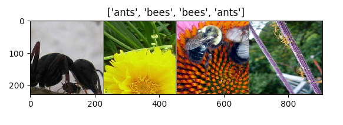

# 迁移学习教程  

来自[这里](https://pytorch.org/tutorials/beginner/transfer_learning_tutorial.html)。  

在本教程中，你将学习如何使用迁移学习来训练你的网络。在[cs231n notes](https://cs231n.github.io/transfer-learning/)你可以了解更多关于迁移学习的知识。  


```text
    在实践中，很少有人从头开始训练整个卷积网络(使用随机初始化)，因为拥有足够大小的数据集相对较少。相反，通常在非常大的数据集(例如ImageNet，它包含120万幅、1000个类别的图像)上对ConvNet进行预训练，然后使用ConvNet作为初始化或固定的特征提取器来执行感兴趣的任务。
```  

两个主要的迁移学习的场景如下：  

* **Finetuning the convert**：与随机初始化不同，我们使用一个预训练的网络初始化网络，就像在imagenet 1000 dataset上训练的网络一样。其余的训练看起来和往常一样。
* **ConvNet as fixed feature extractor**：在这里，我们将冻结所有网络的权重，除了最后的全连接层。最后一个全连接层被替换为一个具有随机权重的新层，并且只训练这一层。  

```python
#!/usr/bin/env python3

# License: BSD
# Author: Sasank Chilamkurthy

from __future__ import print_function,division

import torch
import torch.nn as nn
import torch.optim as optim
import numpy as np 
import torchvision
from torchvision import datasets,models,transforms
import matplotlib.pyplot as plt 
import time
import os
import copy

plt.ion()   # 交互模式

```

## 导入数据  

我们使用`torchvision`和`torch.utils.data`包来导入数据。  

我们今天要解决的问题是训练一个模型来区分**蚂蚁**和**蜜蜂**。我们有蚂蚁和蜜蜂的训练图像各120张。每一类有75张验证图片。通常，如果是从零开始训练，这是一个非常小的数据集。因为我们要使用迁移学习，所以我们的例子应该具有很好地代表性。  

这个数据集是一个非常小的图像子集。  

> 你可以从[这里](https://download.pytorch.org/tutorial/hymenoptera_data.zip)下载数据并解压到当前目录。  

```python
# 训练数据的扩充及标准化
# 只进行标准化验证
data_transforms = {
    'train': transforms.Compose([
        transforms.RandomResizedCrop(224),
        transforms.RandomHorizontalFlip(),
        transforms.ToTensor(),
        transforms.Normalize([0.485, 0.456, 0.406], [0.229, 0.224, 0.225])
    ]),
    'val': transforms.Compose([
        transforms.Resize(256),
        transforms.CenterCrop(224),
        transforms.ToTensor(),
        transforms.Normalize([0.485, 0.456, 0.406], [0.229, 0.224, 0.225])
    ])
}

data_dir = 'data/hymenoptera_data'
image_datasets = {x: datasets.ImageFolder(os.path.join(
    data_dir, x), data_transforms[x]) for x in ['train', 'val']}
dataloaders = {x: torch.utils.data.DataLoader(
    image_datasets[x], batch_size=4, shuffle=True, num_workers=4) for x in ['train', 'val']}

dataset_size = {x:len(image_datasets[x]) for x in ['train','val']}
class_name = image_datasets['train'].classes

device = torch.device('cuda:0' if torch.cuda.is_available() else 'cpu')
```  

### 可视化一些图像

为了理解数据扩充，我们可视化一些训练图像。  

```python
def imshow(inp, title=None):
    inp = inp.numpy().transpose((1, 2, 0))
    mean = np.array([0.485, 0.456, 0.406])
    std = np.array([0.229, 0.224, 0.225])
    inp = std * inp + mean
    inp = np.clip(inp, 0, 1)
    plt.imshow(inp)
    if title is not None:
        plt.title(title)
    plt.pause(10)    # 暂停一会，以便更新绘图


# 获取一批训练数据
inputs, classes = next(iter(dataloaders['train']))

# 从批处理中生成网格
out = torchvision.utils.make_grid(inputs)

imshow(out, title=[class_name[x] for x in classes])
```  

  

### 训练模型  

