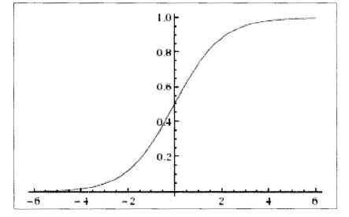

# 问题介绍  

机器学习中的监督学习主要分为回归问题和分类问题，之前已经讲过的回归问题，它希望预测的结果是连续的。分类问题所预测的结果是离散的。这时输入变量可以是离散的，也可以是连续的；而监督学习从数据中学习一个分类模型或者分类决策函数，它被称为分类器（classifier）。分类器对新的输入进行输出预测，这个过程即称为分类（classification）。同时分类问题中包括有二分类和多分类问题，这里先讲讲最著名的二分类算法 --- Logistic回归。  

## Logistic起源  

Logistic起源于对人口数量增长情况的研究，后来又被应用到了对微生物生长情况的研究，以及解决经济学相关的问题。现在作为回归分析的一个分支来处理分类问题。接下来将从Logistic分别入手，再由Logistic分布退出Logistic回归。  

## Logistic分布  

设X是连续的随机变量，服从Logistic分布是指X的积累分布函数和密度函数如下： 

$$F(x) = P(X\leq x) = \frac{1}{1 + e^{-(x-\mu)/\gamma}}$$  

$$f(x) = \frac{e^{-(x-\mu)/\gamma}}{\gamma(1+e^{-(x-\mu)/\gamma})^2}$$  

其中$\mu$影响中心对称点的位置，$\gamma$越小中心点附近的增长速度越快。  

在深度学习中常用的以个非线性变换Sigmoid函数是Logistic分布函数中$\gamma = 1$，$\mu = 0$的特殊形式，其函数表达式形式如下：  
$$p(x) = \frac{1}{1+e^{-x}}$$  

其函数图如下所示：  
  

## 二分类的Logistic回归  

Logistic回归不仅可以解决二分类问题，也可以解决多分类问题，但是二分类问题最为常见同时也具有良好的解释性。对于二分类问题，Logistic回归的目标是希望找到一个区分度足够好的决策边界，能够将两类很好地分开。  

假设输入的数据的特征向量$x \in R^n$，那么决策边界可以表示为$\sum^n_{i=1}w_ix_i + b = 0$；假设存在一个样本点使得$h_w(x) = \sum^n_{i=1}w_ix_i + b > 0$，那么可以判定它的类别是1；如果$h_w(x) = \sum^n_{i=1}w_ix_i + b < 0$，那么可以判定它的类别是0.这个过程其实是一个感知机的过程，通过决策函数的符号来判断其属于哪一类。而Logistic回归要更进一步，通过找到分类概率$P(Y = 1)$与输入变量x的直接关系，然后通过比较概率值来判断类别，简单来说就是通过计算下面两个概率分布：  
$$P(Y = 0|x) = \frac{1}{1+e^{w·x+b}}$$  
$$P(Y = 1|x) = \frac{e^{w·x+b}}{1+e^{w·x+b}}$$  

其中w是权重，b是偏置。  

在介绍Logistic模型的特点之前，先引入一个概念：一个事件发生的几率（odds）是指该事件发生的概率与不发生的概率的比值，比如一个事件发生的概率为p，那么该事件发生的几率是$\frac{p}{1-p}$，该事件的对数几率或logit函数是：  
$$logit(p) = log\frac{p}{1-p}$$  

对于Logistic回归而言，则  
$$log\frac{P(Y = 1|x)}{1-P(Y = 1|x)} = w·x + b$$  

也就是说在Logistic回归模型中，输出$Y = 1$的对数几率是输入x的线性函数，这也就是Logistic回归名称的原因。  

Logistic回归的另一种定义：线性函数的值越接近正无穷，概率值越接近1；线性函数的值越接近负无穷，概率值越接近0.因此Logistic回归的思路是先拟合决策边界（这里的决策边界不局限于线性，也可以是多项式），再建立这个边界和分类概率的关系，从而得到二分类情况下的概率。