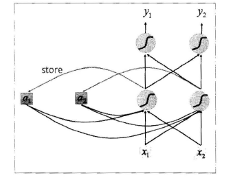
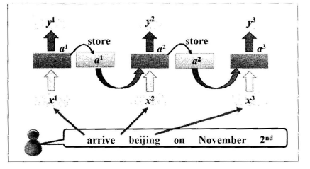
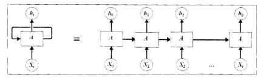
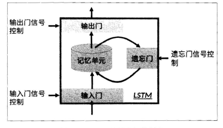
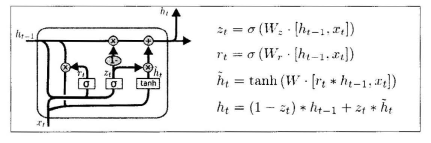
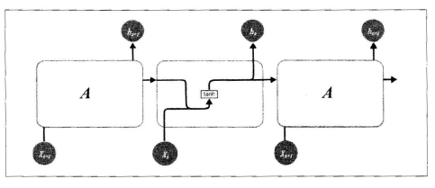
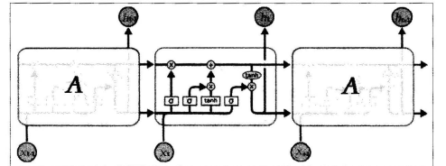

# 循环神经网络  

卷积神经网络相当于人类的视觉，但它并没有记忆能力，所以它只能处理一种特定的视觉任务，无法根据以前的记忆来处理新的任务。那么记忆力对于网络而言到底是不是必要的呢？很显然在某些问题上是必要。比如，在一场电影中推断下一个时间点的场景，这个时候仅依赖于现在的情景并不够，需要依赖于前面发生的情节。对于这样一些依赖于当前的情况，还要依赖于过去情况的问题，传统的神经网络结构无法很好地处理，所以基于记忆的网络模型是必不可少。  

循环神经网络的提出便是基于记忆模型的想法，期望网络能够记住前面出现的特征，并依据特征推断后面的结果，而且整体的网络结构不断循环，因此得名循环神经网络。  

## 循环神经网络的基本结构  

循环神经网络的基本结构特别简单，就是将网络的输出保存在一个记忆单元中，这个记忆单元和下一次的输入一起进入神经网络中。使用一个简单的两层网络作为示范，在它的基础上扩充为循环神经网络的结构，用下图简单地表示：  

  

可以看到网络在输入的时候回联合记忆单元一起作为输入，网络不仅输出结果，还会将结果保存到记忆单元中，上图就是一个简单的循环神经网络在一次输入时的结构示意图。  

从上面的原理可以发现，输入序列的顺序改变，会改变网络的输出结果，这是因为记忆单元的存在，使得两个序列在顺序改变之后记忆单元中的元素也改变了，所以会影响最终的输出结果。  
上图是序列中的一个数据点传入网络的示意图，那么整个序列如何传入网络呢？将序列中的每个数据点依次传入网络即可，如下图所示：  

  

无论序列有多长，都能不断输入网络，最终得到结果。那么上图中每一个网络是不是都是独立的权重？对于这个问题，先考虑一下如果是不同的序列，那么上图中格子的数目就是不同的，对于一个网络结构，不太可能出现这种参数数目变化的情况。  

事实上，这里再次使用了参数共享的概念，也就是说虽然上面有三个格子，但其实它们都是同一个格子，而网络的输出依赖于输入和记忆单元，可以用下图表示：  

  

如上图所示，左边就是循环神经网络实际的网络流，右边是将其展开的结果，可以看到网络中具有循环结构，这也是循环神经网络名字的由来。同时根据循环神经网络的结果也可以看出它在处理序列类型的数据上具有天然的优势，因为网络本身就是一个序列结构，这也是所有循环神经网络最本质的结构。  

循环神经网络也可以有很深的网络层结构；而且网络层不仅可以是单向的，也可以是双向的。使用双向循环神经网络，网络会先从序列的正方形读取数据，再从反方向读取数据，最后将网络输出的两种结果合在一起形成网络的最终输出结果。  

## 存在的问题  

记忆最大的问题在于它有遗忘性，我们总是更加清楚地记得最近发生的事情而遗忘很久之前发生的事情，循环神经网络同样有这样的问题。如果一项任务需要依赖近期的信息来预测结果，循环神经网络往往具有比较好的表现；但对于长时依赖的问题，循环神经网络的表现就不再那么好的表现。  

长时依赖的问题导致循环神经网络在实际应用上一直没办法取得很好地效果，那么能不能解决呢？从理论上说，循环神经网络完全能够解决这种长时依赖的问题，可以针对具体问题，人为挑选一些特定的参数来解决，但这并不具有普适性，因为循环神经网络没有办法自己决定该挑选哪些参数。  

早期循环神经网络的发展存在长时依赖的问题，后来依据循环神经网络的基本结构，有人提出了一些特定的变式，这些变式解决了长时依赖的问题，并在此后循环神经网络的应用中成为主流。接下来就介绍两种目前循环神经网络最为流行的结构：LSTM和GRU。  

# 循环神经网络的变式：LSTM和GRU  

## LSTM  

LSTM，1997年由Hochreiter和Schmidhuber提出，是 Long Short Term Memory Networks的缩写，即长的短时记忆网络，从字面意思知道它解决的仍然是短时记忆的问题，只不过这种短时记忆比较长，能在一定程度上解决长时依赖的问题。  

循环神经网络的结构都是链式循环的网络结构，LSTM的网络结构大体上也是这样的结构，不过LSTM在网络的内部有着更加复杂的结构，所有它能够处理长时依赖的问题。  

LSTM的抽象网络结构如下图所示。从图中可以看出LSTM由三个门来控制：输入门、遗忘门和输出门。顾名思义，输入门控制着网络的输入，遗忘门控制着记忆单元，输出门控制着网络的输出。这其中最重要的就是遗忘门，它决定之前的哪些记忆将被遗忘，哪些记忆将被去掉。正是由于遗忘门的作用，使得LSTM具有了长时记忆的功能，对于给定的任务，遗忘门能够自己学习保留多少以前的记忆，不再需要人为干预，网络就能够自主学习。  

  

## GRU  

GRU，有Cho在2014年提出，是Gated Recurrent Unit的缩写。GRU与LSTM最大的不同在于GRU将遗忘门和输入门合成了一个“更新门”，同时网络不再额外给出记忆状态$C_t$，而是将输出结果$h_t$作为记忆状态不断向后循环传递，网络的输入和输出都变得特别简单。  

GRU的计算过程可以用下图表示：  

  

上面给出了GRU具体的计算过程，它和LSTM本质上是相同的，将上一时刻$t - 1$的输出$h_{t-1}$和当前$t$时刻的输入$x_t$结合起来计算各种衰减系数，略微不同的地方是，线性变换没有使用偏置，由于记忆状态也是$h_{t-1}$，所以直接对它进行更新即可，最后输出网络的结果$h_i$，这个结果也是网络的记忆状态。  

## 收敛性问题  

循环神经网络都存在一个无可避免的问题，那就是收敛性。  

如果写了一个简单的LSTM网络去训练数据，你会发现loss并不会按照想象的方式下降，运气好的化能够得到一直下降的loss，但大多数情况下loss都是在乱跳着的。这在循环神经网络的发展初期形成了很大的阻碍，因为这种不稳定的训练过程是无法使用的。同时人们发现，卷积神经网络不会出现这种跳跃的loss。在随后的研究中，人们发现出现这种情况的根本原因是因为RNN的误差曲面粗糙不平。误差曲面上存在很多陡峭的斜坡，斜坡上误差的变化率特别大，正是这个原因导致了loss曲线的不断跳跃。  

对于这种基于循环的网络结构的不规则、陡峭的斜坡曲面，能够采用什么方法对网络进行训练呢？引起这个问题的原因就是权重在网络中循环的结构里面会不断地被重复使用，这样梯度微小的变化在经过循环的结构之后都被放大。那么有没有办法来解决这个问题呢？答案是肯定的，有，那就是梯度裁剪（gradient clipping）。使用梯度裁剪能够将大的梯度裁剪掉，这样就能够在一定程度上避免收敛不好的问题。  

# 循环神经网络的PyTorch实现  

PyTorch中已经集成好了关于循环神经网络的一切供我们调用，接下来介绍循环神经网络的PyTorch实现。  

## PyTorch的循环网络模块  

下面分别介绍标准RNN、LSTM和GRU模块在PyTorch中的调用。  

### 标准RNN  

先给出标准RNN的示意图，如下图所示，然后按照图中所示来介绍PyTorch中的API。  

  

从图中可以看到在标准RNN的内部网络中，计算公式如下：  

$$h_t = tanh(w_{ih} * x_t + b_{ih} + w_{hh} * h_{t-1} + b_{hh})$$  

在PyTorch中的调用也非常简单，使用nn.RNN()即可。下面一次介绍其中的参数。  

input_size 表示输入$x_t$的特征维度；hidden_size 表示输出$h_t$的特征维度；num_layers 表示网络层数，默认是1层；nonlinerity 表示非线性激活函数的选择，默认是tanh，可以选择relu；bias 表示是否使用偏置，默认是True；batch_first 这个参数是决定网络输入的维度顺序，默认网络输入时按照（seq、batch、feature）输入的，也就是序列的长度放在最前面，然后是批量，最后是特征维度，如果这个参数设置为True，那么顺序就变为（batch、seq、feature）；dropout 这个参数接受一个0 ~ 1的数值，会在网络中除了最后一层之外的其他输出层加上dropout层；bidriectional 默认是False，如果设置为True，就是双向循环神经网络的结果。  

接着在介绍网络接收的输入和输出。网络会接收一个序列输入$x_t$和记忆输入$h_0$，$x_t$的维度是（seq、batch、feature），分别表示序列的长度、批量和输入的特征维度，$h_0$也叫隐藏状态，它的维度是（layers*direction，batch，hidden），分别表示层数乘方向（如果是单向，就是1，如果是双向就是2）、批量和输出的维度。网络会输出output和$h_n$，output表示网络实际的输出，维度是（seq、batch、layers*direction），分别表示序列长度、批量和输出维度乘上方向，$h_n$表示记忆单元，维度是（layers*direction，batch，hidden），分别表示层数乘方向、批量和输出的维度。  

### LSTM  

LSTM在本质上和标准RNN是一样的，只不过LSTM内部的计算更加复杂、参数更多、输入和输出的数目也更多。  

LSTM计算过程如下图，在PyTorch中调用nn.LSTM()即可，其中的参数和标准RNN中的参数一样，下面介绍LSTM与标准RNN不同的地方。  

  

首先，LSTM的参数比标准RNN多，但访问的方式仍然是相同的，使用weight_ih_l0即可，只是里面的维度和标准RNN不再相同，它是标准RNN维度的4倍，因为LSTM中间比标准RNN多了三个线性变换，多的三个线性变换的权重拼在一起，所以一共是4倍，同理偏置也将是4倍，即LSTM里面做了4个类似标准RNN所做的运算。  

其次，LSTM的输入也不再只有序列输入和隐藏状态，隐藏状态除了$h_0$之外，还多了一个$C_0$，它们合在一起成为网络的隐藏状态，二期它们的大小完全一样，就是（layers*direction，batch，hidden），当然输出也会有$h_0$和$C_0$。  

### GRU  

GRU本质上和LSTM是一样，这里介绍它和LSTM不同的地方。  

首先，它的隐藏状态参数不再是标准RNN的4倍，而是3倍，这是由它内部计算结果确定的。同时网络的隐藏状态也不再是$h_0$和$C_0$，其余部分和LSTM完全一样。  

除了上述之外，PyTorch还提供了RNNCell、LSTMCell、GRUCell，它们是上面三个函数的单步版本，也就是说它们的输入不再是一个序列，而是一个序列中的一步，也可以说是循环神经网络的一个循环，在序列的应用上更加灵活，因为序列中的每一步都是手动实现的。

