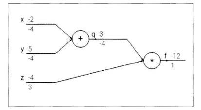

# 反向传播算法  

前面介绍了前向传播的多层全连接神经网络，一个核心的问题就是给出了损失函数f，我们需要更新参数那就需要算出f的梯度$\nabla f(x)$，那么我们如何才能有效地求出这个梯度呢？  
反向传播算法就是一个有效地求解梯度的算法，本质上其实就是一个链式求导法则的应用。

接下来就详细介绍下什么是反向传播算法。  

## 链式法则  

首先简单介绍下链式法则。考虑一个简单的函数，比如$f(x,y,z) = (x + y)z$，虽然我们可以直接求出这个函数的微分，但是这里我们要使用链式法则，令$q = x + y$，那么$f = qz$，对于这两个表达式，分别求出它们的微分，$\frac{\partial f}{\partial q} = z,\frac{\partial f}{\partial z} = q$，同时q是x和y的求和，所以$\frac{\partial q}{x} = 1,\frac{\partial q}{y} = 1$。我们关心的问题是$\frac{\partial f}{\partial x},\frac{\partial f}{\partial y},\frac{\partial f}{\partial z}$，链式法则告诉我们如何计算出它们的值。  

$$\frac{\partial f}{\partial x} = \frac{\partial f}{\partial q}\frac{\partial q}{\partial x}$$  
$$\frac{\partial f}{\partial y} = \frac{\partial f}{\partial q}\frac{\partial q}{\partial y}$$
$$\frac{\partial f}{\partial z} = q$$  

通过链式法则知道，如果需要对其中的元素求导，那么可以一层一层求导，然后将结果乘起来，这就是链式法则的核心，也是反向传播算法的核心。  

## 反向传播算法  

反向传播算法本质上只是链式法则的一个应用。还是使用之前的例子$q = x + y,f = qz$，通过计算图可以将这个计算过程表达出出来，如下图所示： 
  

上面的数字表示其数值，下面的数字表示求出的梯度。接下来介绍反向传播算法的实现。首先从最后开始，梯度为1，然后计算$\frac{\partial f}{\partial q} = z = -4,\frac{\partial f}{\partial z} = q = 3$，接着计算$\frac{\partial f}{\partial x} = \frac{\partial f}{\partial q}\frac{\partial q}{\partial x} = -4 x 1 = -4,\frac{\partial f}{\partial y} = \frac{\partial f}{\partial q}\frac{\partial q}{\partial y} = -4 x 1 = -4$，这样一步一步地求出$\nabla f(x,y,z)$。  

直观上看反向传播算法是一个优雅的局部过程，每次求导只是对当前的运算求导，求解每层网络的参数都是通过链式法则将前面的结果求出不断迭代到这一层，所以说这是一个传播过程。  
