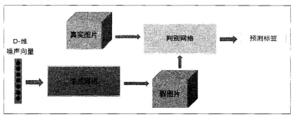

# 生成对抗网络  

长久以来，人们都希望机器能够充满创造力，不仅能完成重复的机械劳动，还能完成一些创造性的工作，比如画画、写诗创作歌词等。这些一直是人工智能长久以来的梦想，随着自动编码器和变分编码器的提出，这一梦想慢慢变成了现实。Ian Goodfellow 于2014年提出了生成对抗网络（Generative Adversarial Networks，GANs）这一概念，推进了整个无监督学习的发展进程。  

接下来从最简单的生成模型（Generative Model）入手，包括自动编码器（Autoen-coder）和变分自动编码器（Variational AutoEncoder，VAE），接着详细地介绍生成对抗网络的创新和原理，以及为何生成对抗网络能够成为现在最热门的研究领域。  

## 生成模型  

生成模型（Generative Model）这一概念属于概率统计和机器学习，是指一系列用于随机生成可观测数据的模型。简而言之，就是“生成”的样本和“真实”的样本尽可能地相似。生成模型的两个主要功能就是学习一个概率分布$P_{model}(X)$和生成数据，这是非常重要的，不仅能够用在无监督学习中，还可以用在监督学习中。  

### 自动编码器  

自动编码器（AutoENcoder）最开始作为一种数据的压缩方法，其特点有：  

* 跟数据相关程度很高，这意味着自动编码器只能压缩与训练数据相似的数据。
* 压缩后数据是有损的，这是因为在降维的过程中不可避免地要丢失信息。  

现在自动编码器主要应用在两个方面：第一是数据去噪，第二是进行可视化降维。自动编码器还有一个功能，即生成数据。  

下图给出自动编码器的一般结构，从图中能够看到两个部分：第一个部分是编码器（Encoder），第二个部分是解码器（Decoder）。编码器和解码器都可以是任意的模型，通常使用神经网络模型作为编码器和解码器：输入的数据经过神经网络降维到一个编码（code），接着又通过另一个神经网络去解码得到一个与输入原数据一模一样的生成数据，然后通过比较这两个数据，最小化它们之间的差异来训练这个网络中编码器和解码器的参数。当这个过程训练完之后，拿出这个解码器，随机传入一个编码（code），通过解码器能够生成一个和原数据差不多的数据。

  

### 变分自动编码器  

变分自动编码器（Variational AutoEncoder）是自动编码器的升级版本，它的结构跟自动编码器相似，也是由编码器和解码器构成的。  

在自动编码器中，需要输入一张图片，然后将图片编码之后得到一个隐含向量，这比随机取一个随即向量好，因为这包含了原图片的信息，然后将隐含向量解码得到与原图片对应的照片。但这样其实并不能任意生成图片，因为没办法自己去构造隐藏向量，需要通过一张图片输入编码才知道得到的隐含向量是什么。变分自动编码器就是为了解决这个问题而出现的。  

原理很简单，只需要在编码过程给它增加一些限制，迫使它生成的隐含向量能够粗略地遵循一个标准正态分布，这就是它与一般自动编码器的最大不同。  

通过变分自动编码器生成一张新的图片就很简单了，只需要给它一个标准正态分布的随机隐含向量，通过解码器就能够生成想要的图片，而不需要先给它一张原始图片进行编码。  

在实际使用时，需要在模型的准确率（指解码器生成的图片与原图片的相似程度）上与隐含向量服从标准正态分布之间做一个权衡，可以让神经网络自己做这个决定，只需要将这两者都做一个loss，然后再将它们求和作为总loss，这样网络就能够自己选择如何做才能使得这个总的loss下降。此外，要衡量两种分布的相似程度，需要引入一个新的概念，KL divergence，用来衡量两种分布相似程度的统计量，它越小，表示两种概率分布越接近。  

对于离散的概率分布，定义如下：  

$$D_{KL}(P||Q) = \sum_iP(i)log\frac{P(i)}{Q(i)}$$  

对于连续的概率分布，定义如下：  

$$D_{KL}(P||Q) = \int^\infty_{-\infty}p(x)log\frac{p(x)}{q(x)}dx$$  

这里就是使用KL divergence表示隐含向量与标准正态分布之间差异的loss，另一个loss仍使用生成图片与原图片的均方误差来表示。  

变分编码器使用“重新参数化”解决KL divergence的计算问题。这样就不用每次生成一个隐含向量，而是生成两个向量：一个表示均值，一个表示标准差。然后通过这两个统计量合成隐含向量，用一个标准正态分布先乘标准差再加上均值就行了，这里默认编码之后的隐含向量是服从一个正态分布的。此时要让均值尽可能接近0，标准差尽可能接近1.  

变分编码器除了可以随机生成隐含变量，还能够提高网络的泛化能力。  

尽管变分编码器有以上优点，但他同样有自动编码器的缺点，那就是直接计算生成图片和原始图片的均方误差来作为损失函数，使得生成的图片优点模糊。  

## 生成对抗网络  

### 何为生成对抗网络  

生成对抗网络有两部分组成：生成和对抗。这个网络的第一部分是生成模型；第二部分是对抗模型，严格来讲他是一个判断真假图片的判别器，生成对抗网络的最大创新之处，也是与自动编码器的最大区别之处。简言之，生成对抗网络就是让两个网络互相竞争，通过生成网络生成假的数据，对抗网络通过判别器判别真伪，最后希望生成网络生成的数据能够以假乱真骗过判别器。其过程如下图所示：  

  

#### 生成模型  

自动编码器已经给出了一般的生成模型。在生成对抗网络中，不再是将图片输入编码器得到隐含向量然后生成图片，而是随机初始化一个隐含向量，根据变分自动编码器的特点，初始话一个正态分布的隐含向量，通过类似解码的过程，将它映射到一个更高的维度，最后生成一个与输入数据相似的假的图片。自动编码器是通过对比两张图片之间的每个像素点的差异计算损失函数，而生成对抗网络通过对抗过程来计算出这个损失函数，如下图所示：  

  

#### 对抗模型  

对抗过程是生成对抗网络相对于之前生成模型如自动编码器等最大的创新。  

对抗过程简单来说就是一个判断真假的判别器，相当于一个二分类问题：输入一张真的图片希望判别器输出的结果是1，输入一张假的图片希望判别器输出的结果是0。  

在训练的时候，先训练判别器，将假的数据和真的数据都输入给判别模型，优化这个判别模型，使它能够正确地判断出真数据和假数据。然后开始训练生成器，使它生成能够骗过训练好的判别器的假数据。  

## Improving GAN  

### Wasserstcin GAN

Wasserstcin GAN是GAN的一种变式。GAN的训练是非常麻烦的，需要很多训练技巧，而且在不同的数据集上，由于数据的分布会发生变化，也需要重新调整参数，不仅需要小心地平衡生成器和判别器的训练进程，同时生成的样本还缺乏多样性。除此之外最大的问题是没办法衡量这个生成器到底好不好，因为没办法通过判别器的loss去判断这个事情。  

WGAN的出现，彻底解决了下面的难点：  
* 彻底解决了训练不稳定的问题，不再需要设计参数去平衡判别器和生成器；
* 基本解决了collapse mode的问题，确保了生成样本的多样性；
* 训练中有一个向交叉熵、准确率的数值指标来衡量训练的进程，数值越小代表GAN训练的越好，同时也就代表着生成的图片质量越高；
* 不需要精心设计网络结构，用简单的多层感知器就能取得比较好的效果。  
