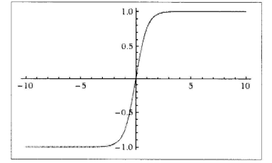
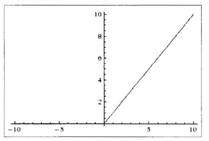

# 简单的多层全连接前向网络  

深度学习的前身是神经网络，但由于之前的计算能力与数据量不足、传统机器学习方法如支持向量机完美的数学解释等原因，使得深度学习一直没有发展起来，直到近几年才有了爆发式的发展。接下来从神经网络算法入手来介绍深度学习。  

## 单层神经网络的分类器  

一个简单的一层神经网络的数学形式是特别简单的，可以看成一个线性运算再加上一个激活函数，正如一个神经元可以对一个输入进行不同的操作，可以是“喜欢”（激活变大）或者是“不喜欢”（激活变小），正式由于激活函数的作用，我们可以将一层神经网络用作分类器：正样本让激活函数激活变大，负样本让激活函数激活变小。  

例如我们可以使用Sigmoid激活函数做一个二分类问题，此时使用数学形式$\sigma(\sum^n_{i=1}w_ix_i+b)$表示$P(y_i = 1|x_i,w)$，即输出位1类的概率，那么输出为0类的概率为$1-P(y_i = 1|x_i,w)$,将$P(y_i = 1|x_i,w)$展开可得：  

$$P(y_i = 1|x_i,w) = \sigma(\sum^n_{i=1}w_ix_i+b)$$
$$ = \frac{1}{1+e^{-(w_ix_i+b)}}$$
$$ = \frac{e^{w_ix_i+b}}{1+e^{w_ix_i+b}}$$  

这就是前面介绍过的Logistic回归，所以Logistic回归只是一个是用来Sigmoid作为激活函数的一个层神经网络。  

## 激活函数  

下面介绍一下神经网络中的各种常用的激活函数。  

### Sigmoid  

Sigmoid非线性激活函数的数学表达式是$\sigma(x) = \frac{1}{1+e^{-1}}$，其图形如下图所示。从图像可知，Sigmoid激活函数试讲一个实数输入转化到0 ~ 1之间的输出，具体来说就是将越小的负数转化到越靠近0，越大的正数转化到越靠近1。

  

#### 优势  

引其具有良好的解释性，历史上被频繁使用。  

#### 缺点  

最近几年，Sigmoid激活函数已经越来越少地被人使用，主要是因为以下两大缺点：  

1. Sigmoid函数会造成梯度消失 。最大的特点就是Sigmoid函数在靠近1和0的两端时，梯度会几乎变成0。梯度下降法通过梯度乘上学习率来更新参数，因此如果梯度接近0，那么将没有任何信息来更新参数，这样就会造成模型不能收敛。另外，如果使用Sigmoid函数，那么需要在初始化权重的时候必须非常小心。如果初始化的时候权重太大，那么经过激活函数也会导致大多数神经元变得饱和，无法更新参数。  
 
2. Sigmoid输出不是以0为均值，这就导致进过Sigmoid激活函数之后的输出，作为后面一层网络的输入的时候是非0均值，此时如果进入下一次神经元的输入全是正的，将导致梯度全是正的，那么在更新参数的时候都是正梯度。不过因为一般神经网络在训练的时候都是按batch进行训练的，可以在一定程度上缓解这个问题。  

### Tanh  

Tanh激活函数是上面Sigmoid激活函数的变形，其数学表达式为$tanh(x) = 2\sigma(2x) - 1$，图形如下所示：  

  

它将输入的数据转化到-1 ~ 1之间，从图像可以看出它将输出变成了0均值，在一定程度上解决了Sigmoid函数的第二个问题，但仍存在梯度消失的问题。相比Sigmoid函数，Tanh激活函数更具优势。  

### ReLU  

ReLU激活函数（Rectified Linear Unit）近几年变得越来越流行，它的数学表达式为$f(x) = max(0,x)$，换句话说，这个激活函数只是简单地将大于0的部分保留，将小于0的部分变成0，其图像如下图所示：  

  

#### ReLU函数优点  

1. 相比于Sigmoid激活函数和Tanh激活函数，ReLU激活函数能够及大地加速随机梯度下降法的收敛速度，这是因为它是线性的，且不存在梯度消失的问题。  
2. 相比于Sigmoid激活函数和Tanh激活函数的复杂计算而言，ReLU的计算方法更加简单，只需要一个阈值过滤就可以达到结果，不需要进行一大堆负载的运算。  

#### ReLU的缺点  

训练的时候很脆弱。比如一个很大的梯度进过ReLU激活函数，更新参数之后，会使得这个神经元不会对任何数据有激活现象。发生这种情况之后，经过ReLU的梯度永远为0，也就意味着参数无法再更新了，因为ReLU激活函数本质上是一个不可逆的过程，它会直接去掉小于0的部分。实际操作中可以通过设置较小的学习率来避免这个问题。  

### Leaky ReLU  

Leaky ReLU激活函数是ReLU激活函数的变式，主要是为了修复ReLU激活函数中训练比较脆弱的这个缺点：不将$x<0$的部分变成0，而是给它一个很小的负斜率，比如0.01，它的数学表达式为$f(x) = I(x<0)(\alphax)+I(x>0)(x)$，其中$\alpha$是一个很小的常数，这样就可以使得输入小于0的时候也有一个小的梯度。关于此激活函数的效果，众说纷纭，一些实验证明很好，一些实验证明并不好。  

同时也有人体术可以对$\alpha$进行参数化处理，也就是说在网络的训练过程中对$\alpha$也进行更新，但是否对所有情况都有效，目前尚不清楚。  

### Maxout  

Maxout激活函数，其数学表达式为$max(w_1x+b_1,w_2x+b_2)$。从表达式可以看出，ReLU激活函数只是Maxout中$w_1=0,b_1=0$的特殊形式，因此Maxout既有这ReLU激活函数的优点，同时也避免了ReLU激活函数训练脆弱的缺点。不过，它也有一个缺点，那就是它加倍了模型的参数，导致了模型的存储变大。  

上面简单介绍了一些激活函数的优缺点，在实际使用中，使用较多的是ReLU激活函数，但要注意学习率的设定不能太大；一定不要使用Sigmoid函数，可以试试Tanh函数，但一般它的效果都比ReLU和Maxout差。最后一点，在实际使用中很少使用混合类型的激活函数，也就是说一般在同一个网络中我们都使用同一类型的激活函数。  

## 神经网络的结构  

神经网络是一个由神经元构成的无环图，换句话说就是一些神经元的输出会变成另外一些神经元的输入，环是不被允许的，因为这样会造成网络中的无限循环。同时神经网络一般是以层来组织的，最常见的神经网络就是全连接神经网络（其中两个相邻层中每一个曾的所有神经元都和另外一个层的所有神经元相连，每个层内部的神经元不相连）。  

一般而言，N层神经网络并不会把输入层算进去，因此一个一层的神经网络是指没有隐藏层、只有输入层和输出层的神经网络。Logistic回归就是一个一层的神经网络。  

输出层一般是没有激活函数的，因为输出层通常表示一个类别的得分或者回归的一个是实值得目标，所以输出层可以是任意的实数。  

## 模型的表示能力与容量  

如果从数学的角度来解释神经网络，那么神经网络就是由网络中的参数决定的函数簇。所谓的函数簇就是一系列的函数，这些函数都是由网络的参数决定的。在提出来函数簇之后，我们就想明确这个函数簇的表达能力，也就是看是否有函数是这个函数簇无法表达的？  

如果一个之后一层隐藏层的神经网络就能够毕竟任何连续函数，那么为什么还要使用更多层的网络呢？这个问题可以这么理解：理论上讲，增加的网络层可以看成是一系列恒等变换的网络层，也就是说这些网络层对输入不做任何变换，这样这个深层的网络结构至少能够达到与这个浅层网络相同的效果；同时在实际使用中发现，更深层的网络具有更好的表现力，同时有着更好的优化结果。  

既然多层网络有着较好的表现能力，那么该如何设置网络的参数呢？比如我们应该设计为几层，每层的节点又应该设计多少个等。首先需要注意的是如果我们增大网络的层数和每层的节点数，相当于在增加网络的容量，容量的增大意味着网络有着更大的潜在表现能力。  

在实际使用过程中，发现如果数据不太复杂，那么容量较小的模型反而有着更好的效果，那么是不是我们可以利用小的模型去处理呢？答案并非如此，首先通过这样的方式没有办法很好地衡量到底多小的模型才算是小的模型，其次小的模型在使用如梯度下降法等训练的时候通常更难。  

因为神经网络的损失函数一般是非凸的，容量小的网络更容易陷入局部极小点而达不到最优的效果，同时这些局部最小点的方差特别大，换言之，也就是每个局部最优点的差异都特别大，所以可能你在训练网络的时候训练10次可能得到的结果有很大的差异。但对于容量更大的神经网络，它的局部极小点的方差特别小，也就是说训练多次虽然可能陷入不同的局部极小点，但它们之间的差异是很小的，这样训练就不会完全依靠随机初始化。  

所以我们更希望使用大容量的网络去训练模型，同时运用一些方法来控制网络的过拟合。